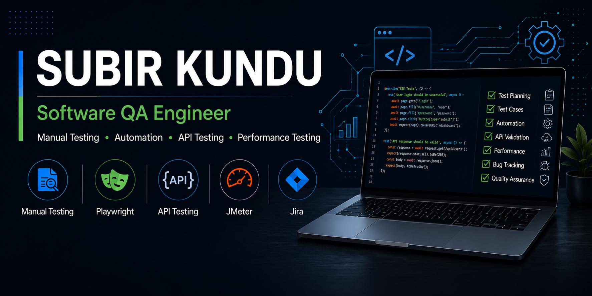

  

## 👋 About Me

Software QA Engineer with 3+ years of experience in Web, Mobile, and ERP system testing. I focus on manual testing, test automation, API testing, and performance testing, with hands-on experience in Playwright, JavaScript, Postman, and JMeter.

## 🧪 What I Do

<table>
  <tr>
    <td width="33%" valign="top">

### 🔍 Manual Testing

* Functional Testing
* Regression Testing
* Smoke & Sanity Testing
* UAT Testing
* Test Planning & Execution

    </td>
    <td width="33%" valign="top">

### 🤖 Test Automation

* Playwright
* JavaScript
* Page Object Model
* Automated Testing
* Test Validation

    </td>
    <td width="33%" valign="top">

### 🔌 API & Performance

* REST API Testing
* Postman
* Swagger
* Apache JMeter
* Performance Testing

    </td>
  </tr>

</table>

## 🛠️ Tech Stack

### Automation

  
  

### API & Performance

  
  
  

### Tools & Workflow

  
  
  
  

## 🤝 Let's Connect

  
  

